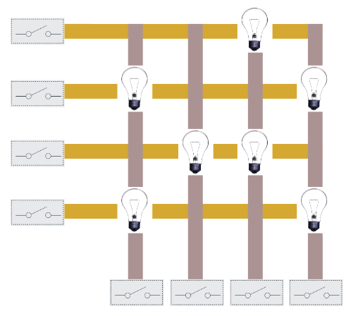

# Max2SAT Solver for Lamp Grids

## Description

This repository contains a **Max2SAT solver** designed to solve **lamp grid puzzles**. The project was developed as part of the **Algorithms 2** course INFO-F203 and applies **Max2SAT** (Maximum 2-Satisfiability) to optimize configurations of lamps in a grid while satisfying the maximum number of constraints. More info in `./pdf/consignes.pdf`.

<p align="center">
  
  <br/>
  <strong>Instance of the lighting problem</strong>
</p>

## Features

- **Max2SAT-based approach**: Transforms the lamp grid problem into a Max2SAT instance.
- **Clustering**: Optimizes Max2SAT instances by identifying independent clusters of lamps.
- **Python & Java Support**: Algorithms available in both Python and Java for Max2SAT solving.

## Usage

Make sure you have `Python >= 3.10` installed.


### Running the Solver

1. Clone the repository:

   ```bash
   git clone https://github.com/Ant0in/Projet-ALGO2.git
   ```

2. Navigate to the project directory:

   ```bash
   cd Projet-ALGO2/
   ```

3. Run the solver on a grid `exemple1.txt`:

   ```bash
   python ./main.py ./tests/exemple1.txt
   ```

## License

This project is licensed under the **MIT License**. You are free to use, modify, and distribute this software.

## Acknowledgements

This project was developed for the Algorithms 2 course `INFO-F203`. Special thanks to `Jean Cardinal (ULB)` for their guidance and support.

